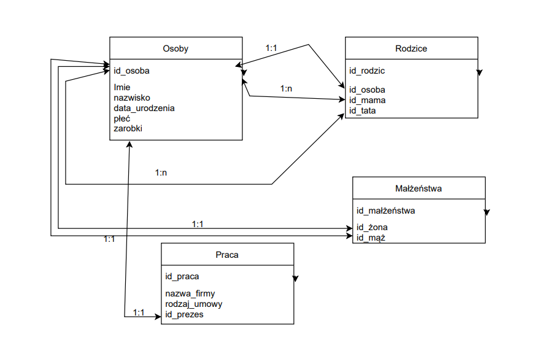

# Contact List

## Summary
Aplikacja zakłada używanie bazy MySql w celu przechowywania informacji na temat poszczególnych kontaktów oraz danych logowania użytkowników. Główna strona wyświetla wszystkie rekordy pobrane z serwera, a w przypadku niepowodzenia będzie o tym informowała!

**W celu włączenia wszystkich funkcjonalności aplikacji należy przeprowadzić migrację w konsoli menedżera pakietów do lokalnego serwera MySql**
1. **PM>add-migration (name)**
2. **PM>update-database**

## Classes
* Contact - Klasa bazowa, której pola pokrywają się z kolumnami klientów z bazy danych. Klasa ta została użyta w celu tworzenia obiektów kontaków, których dane pochodzą z serwera. 

* ApplicationDbContext - Klasa odpowiedzialna za komunikację z bazą danych, w niej został zawarty DbSet<Contact> Contact w celu umożliwienia przeprowadzenia migracji do bazy danych, wyświetlania danych oraz ich modyfikacji.

* Index.cshtml.cs - Główna klasa odpowiedzialna za back-end strony, tutaj trafiają wszystkie dane jakie użytkownik podał do formularza, w celu stworzenia nowego kontaktu lub usunięcia już istniejącego z bazy danych.
     - public IActionResult OnPost(): Metoda, która zostaje wywołana w momencie wysłania formularza. Na podstawie Id obiektu sprawdza czy użytkownik sprecyzował je, aby usunąć kontakt lub w przypdaku id == 0 dodaje nowy obiekt do bazy danych. Zwraca RedirectToPage("Index") w celu odświeżenia strony.
     - private void AddContactDB(Contact newContact): Metoda odpowiedzialna za wprowadzenie nowego obiektu do bazy danych.
     - private void DelContactDB(int id): Metoda, która usuwa na podstawie podanego przez użytkownika Id wybrany rekord z bazy danych. Tutaj zostaje zastosowany prosty LINQ query aby dopasować podane Id do Id obiektu w bazie danych.

## Libs
* EntityFrameworkCore: DataBase migrations
* Pomelo.EntityFrameworkCore.MySql: MySql migration support

<!--
## SQL/ERD

-->
 
<!--[ # Rework Branch is available!
 - [x] Cleaned and Fixed code
 - [x] User Accounts moved to MySql
 - [x] Secured Connection string
 - [x] Data Validation](url)
 
 **Rework Branch has been merged!**

Biblioteki: 
* Pomelo.EntityFrameworkCore.MySql: MySql Migration-->
